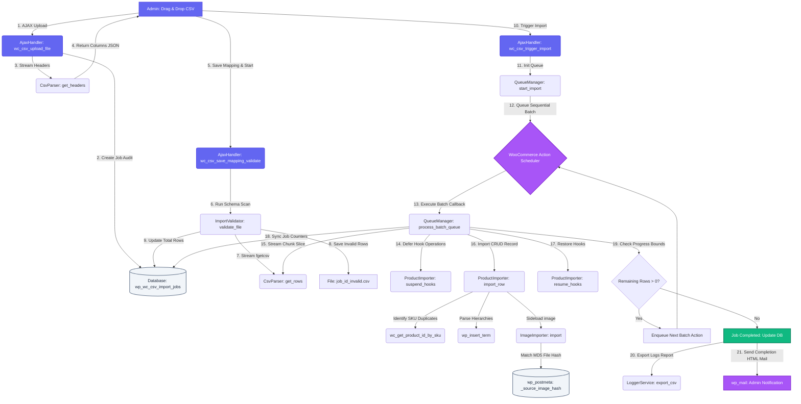

# Advanced WooCommerce CSV Product Importer

[](https://woocommerce.com/)
[](https://woocommerce.com/)
[](https://php.net/)

A professional-grade, high-performance WordPress WooCommerce plugin designed to import large CSV product files (30k+ products) seamlessly on standard hosting environments. Engineered with a scalable, queue-based background processing architecture, strict schema validation, robust retry systems, and optimized database transactions.

---

## 📊 Visual System Architecture Flow

The flowchart below visualizes the asynchronous, multi-step pipeline of the import engine, from secure file upload to background queue processing, reporting, and automated email deliveries.



---

## 🔄 Step-by-Step Execution Workflow

The entire plugin operates in **five distinct architectural stages**. Below is the step-by-step explanation of how the PHP classes, database schemas, and front-end scripts communicate:

### Phase 1: Secure Upload & Registration
1. **Front-End Upload Trigger**: The admin drags and drops a CSV file on [import-wizard.php](file:///C:/Users/sonu/.gemini/antigravity/scratch/advanced-woocommerce-csv-importer/admin/templates/import-wizard.php). The client-side script [admin-script.js](file:///C:/Users/sonu/.gemini/antigravity/scratch/advanced-woocommerce-csv-importer/admin/assets/js/admin-script.js) checks the file extension (`.csv`) and sends a secure AJAX post to `wc_csv_upload_file`.
2. **Security Verification**: The controller [AjaxHandler.php](file:///C:/Users/sonu/.gemini/antigravity/scratch/advanced-woocommerce-csv-importer/admin/AjaxHandler.php) verifies the WordPress Security Nonce and ensures the user possesses the `manage_woocommerce` capability.
3. **Physical File Move**: The upload is securely moved to the WP Uploads folder inside a dedicated directory: `{uploads_dir}/wc-csv-imports/import_{timestamp}_{filename}.csv`.
4. **Job Registry Creation**: The handler calls [JobRepository.php](file:///C:/Users/sonu/.gemini/antigravity/scratch/advanced-woocommerce-csv-importer/includes/Repository/JobRepository.php) to insert a new tracking row in the custom database table `wp_wc_csv_import_jobs` with status set to `pending`.
5. **Header Parsing**: [CsvParser.php](file:///C:/Users/sonu/.gemini/antigravity/scratch/advanced-woocommerce-csv-importer/includes/Services/CsvParser.php) opens the file stream, checks for UTF-8 Byte Order Marks (BOM), extracts the first header line using `fgetcsv()`, auto-detects the delimiter (comma, semicolon, tab), and returns the array of columns to the browser.

### Phase 2: Column Mapping & Pre-Import Validation Scan
1. **User Mapping selection**: The admin is shown the Column Mapping screen. The JavaScript auto-matches standard fields (e.g. `SKU` maps to `sku`, `Regular Price` to `regular_price`). The user specifies duplicates strategy (Skip, Update, Replace, Draft), sets background batch limits (100, 250, 500), and submits the configuration.
2. **Database Configuration Save**: `AjaxHandler::wc_csv_save_mapping_validate` saves the mapping JSON string, run mode, and duplicate instructions into the job row in `wp_wc_csv_import_jobs`.
3. **Stream-Based Pre-Validation**: The [ImportValidator.php](file:///C:/Users/sonu/.gemini/antigravity/scratch/advanced-woocommerce-csv-importer/includes/Services/ImportValidator.php) scanner triggers a complete validation pass of the CSV file:
   - Stream-reads the CSV file in 1000-row chunks.
   - Validates that every row has a mapped product name and SKU.
   - Audits SKU formats, positive decimal prices, and checks that image URL strings start with `http://` or `https://`.
4. **Validation Log Generation**: If invalid rows are found, their row numbers and specific errors are written to a downloadable CSV: `{uploads_dir}/wc-csv-imports/job_{job_id}_invalid.csv`.
5. **Report Display**: The total row metrics, valid row numbers, and a direct download link for invalid rows are returned to the screen.

### Phase 3: sequential Background Queue Processing
1. **Import Activation**: The user triggers the import. `AjaxHandler::wc_csv_trigger_import` starts [QueueManager.php](file:///C:/Users/sonu/.gemini/antigravity/scratch/advanced-woocommerce-csv-importer/includes/Services/QueueManager.php).
2. **Action Scheduler Enqueue**: The queue manager uses the Action Scheduler API (`as_enqueue_async_action`) to schedule a background task hook: `advanced_wc_csv_import_batch` with `job_id`, starting `offset = 0`, and `batch_size`.
3. **Background Batch Execution**: When Action Scheduler triggers the callback `QueueManager::process_batch_queue()` in the background:
   - **Hook Suspension**: [ProductImporter.php](file:///C:/Users/sonu/.gemini/antigravity/scratch/advanced-woocommerce-csv-importer/includes/Services/ProductImporter.php) suspends internal term counts, lookup updates, revision tracking, and transients deletion to accelerate database insertion speed.
   - **Line-Offset Read**: `CsvParser::get_rows()` skips preceding lines using a file stream pointer and reads only the current slice (e.g., rows 1000 to 1250) into memory.
   - **Product Mapping & Saves**: `ProductImporter::import_row()` converts the row values into WooCommerce HPOS CRUD properties (`WC_Product`). It resolves duplicate SKUs, handles nested hierarchical category nodes (e.g., automatically creating parent and child categories like `Electronics > Smart Phones` if they do not exist), and triggers media attachment saves.
4. **Self-Perpetuating Batch Chains**:
   - The hook overrides are restored.
   - The job's progress parameters (processed and failed counts) are updated in `wp_wc_csv_import_jobs`.
   - If the current progress count is less than the total rows, the manager automatically enqueues the **next batch action** starting at `offset + batch_size`.
   - If all rows are completed, the job status is set to `completed`, and the Action Scheduler queue terminates gracefully.

### Phase 4: MD5-Hash Image Sideloading
1. **Image Sideload Call**: During row updates, `ProductImporter` passes remote URLs to [ImageImporter.php](file:///C:/Users/sonu/.gemini/antigravity/scratch/advanced-woocommerce-csv-importer/includes/Services/ImageImporter.php).
2. **Source URL Match check**: The image importer checks `wp_postmeta` for a matching `_source_image_url` meta value. If it exists, it returns the current attachment ID immediately, skipping the download.
3. **Temp Download & Hashing**: If not found, it downloads the remote image to a temporary file via `download_url()`, verifies the file mime type (must be a valid image), and calculates its **MD5 file hash** (`md5_file`).
4. **MD5 Duplicate matching**: It queries `wp_postmeta` for a matching `_source_image_hash`. If the hash exists (meaning the exact same image was already downloaded under a different URL or name), it deletes the temp file and returns the existing attachment ID.
5. **Media Registration**: If the image is entirely new, it moves it to the uploads folder, inserts it as a media attachment (`wp_insert_attachment`), generates metadata sizes, saves the `_source_image_url` and `_source_image_hash` meta tags, and attaches it to the WooCommerce product.

### Phase 5: Auditing, Email Alerts & Automated Retries
1. **Live AJAX Polling**: While the import runs in the background, `admin-script.js` polls `wc_csv_get_progress` every 2 seconds. It updates the progress bar, success/error metrics, and calculates the ETA.
2. **Log Report Export**: When completed, [LoggerService.php](file:///C:/Users/sonu/.gemini/antigravity/scratch/advanced-woocommerce-csv-importer/includes/Services/LoggerService.php) exports job logs to a downloadable CSV: `{uploads_dir}/wc-csv-imports/job_{job_id}_logs.csv`.
3. **Automated HTML Email Notifications**: Upon completion of either the primary import queue or a retry run, `LoggerService::send_completion_email()` is fired. It fetches the site administrator's email (`admin_email`), drafts a beautifully styled HTML report outlining the job statistics, and pushes it out via `wp_mail()`, natively attaching the full execution CSV log file.
4. **Failed Row retries**: If rows failed (due to image download timeouts, malformed prices, etc.), the admin can click "Retry All Failed Rows".
5. **Retry Loop Execution**: [RetryService.php](file:///C:/Users/sonu/.gemini/antigravity/scratch/advanced-woocommerce-csv-importer/includes/Services/RetryService.php) fetches failed rows from `wp_wc_csv_import_logs` and queues a retry batch (`advanced_wc_csv_import_retry_batch`) in the Action Scheduler. If a retry succeeds, the log status is updated to `success`, the database failure counters are decremented automatically, and a completion email is resent with the clean audit log.

---

## 🌟 Key Features

### ⚡ Performance & Scalability
- **Flat Memory Footprint**: Stream reading keeps memory consumption minimal ($<5\text{MB}$), whether importing 100 rows or 100,000 rows.
- **Action Scheduler sequentially batches**: Eradicates PHP timeouts and locks by processing data in short, sequential background tasks.
- **Optimized Term/Lookup Writes**: Deactivates term counting hooks during live transactions to ensure high insertion speeds.

### 📧 Automated Email Audit Reporting
- **HTML Reporting**: Dispatches rich HTML emails immediately when jobs complete, summarizing execution stats (Total, Imported, Failed, Mode, SKU behavior).
- **Log Attachment Integration**: Automatically binds the full log CSV sheet to the outgoing `wp_mail()` request so admins can audit processing details.

### 🛡️ Security Best Practices
- **Strict Role Permissions**: AJAX endpoints locked to the `manage_woocommerce` capability, ensuring only authorized administrators can upload and import products.
- **CSRF Protection**: All form and wizard communications utilize secure WordPress Nonces (`wp_create_nonce`).
- **Data Sanitization**: CSV parser sanitizes headers, files utilize native WordPress sanitization, and SQL interfaces leverage safe `wpdb->prepare()` to eliminate SQL injection vulnerabilities.

---

## 🛠️ Installation & Setup

### Requirements
- PHP 7.4 or higher
- WordPress 5.6 or higher
- WooCommerce 5.0 or higher (WooCommerce must be active)

### Installation Steps
1. Clone or download this repository directly:
   ```bash
   git clone https://github.com/your-username/advanced-woocommerce-csv-importer.git
   ```
2. Move the directory inside your WordPress site's plugins folder:
   `wp-content/plugins/`
3. Go to **WordPress Dashboard -> Plugins** and click **Activate** on *Advanced WooCommerce CSV Product Importer*.
4. Navigate to **WooCommerce -> CSV Importer** to open the wizard dashboard.

---

## 💻 WP-CLI CLI Command
Run high-speed product imports directly from your system terminal with progress indicators:
```bash
wp wc-import path/to/products.csv --batch-size=250 --mode=live --duplicate=update
```

---

## 📄 License
This project is licensed under the GPL v2 or later License.
